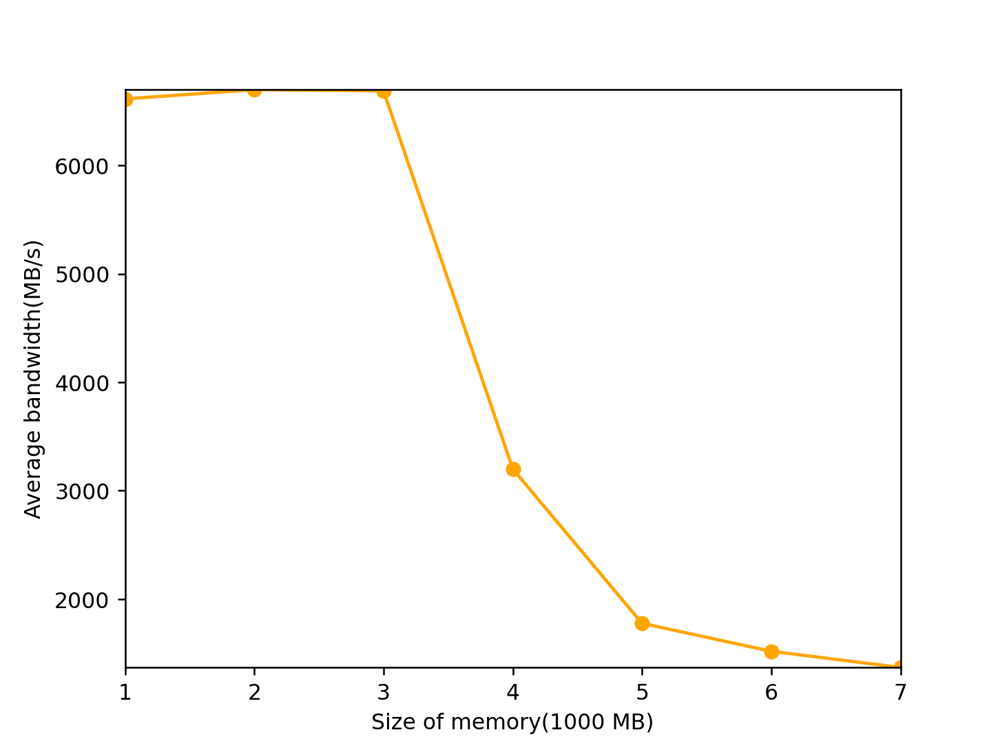
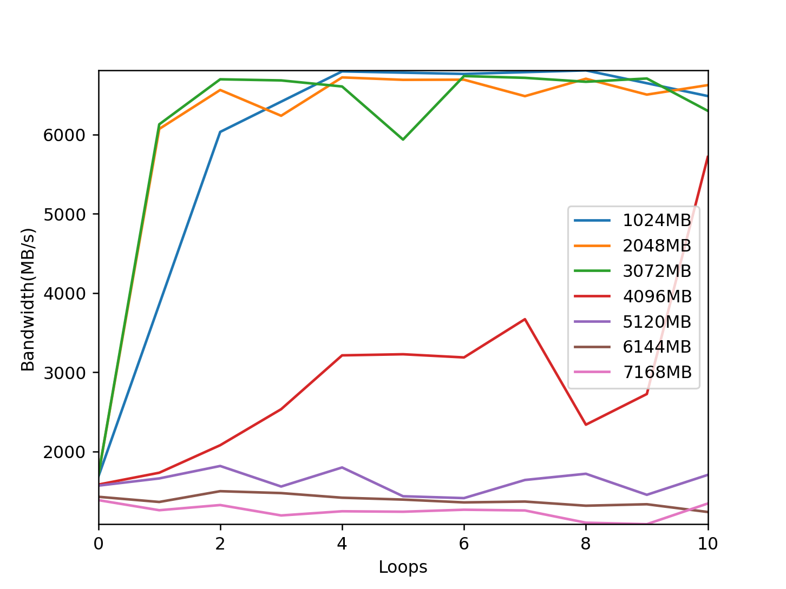
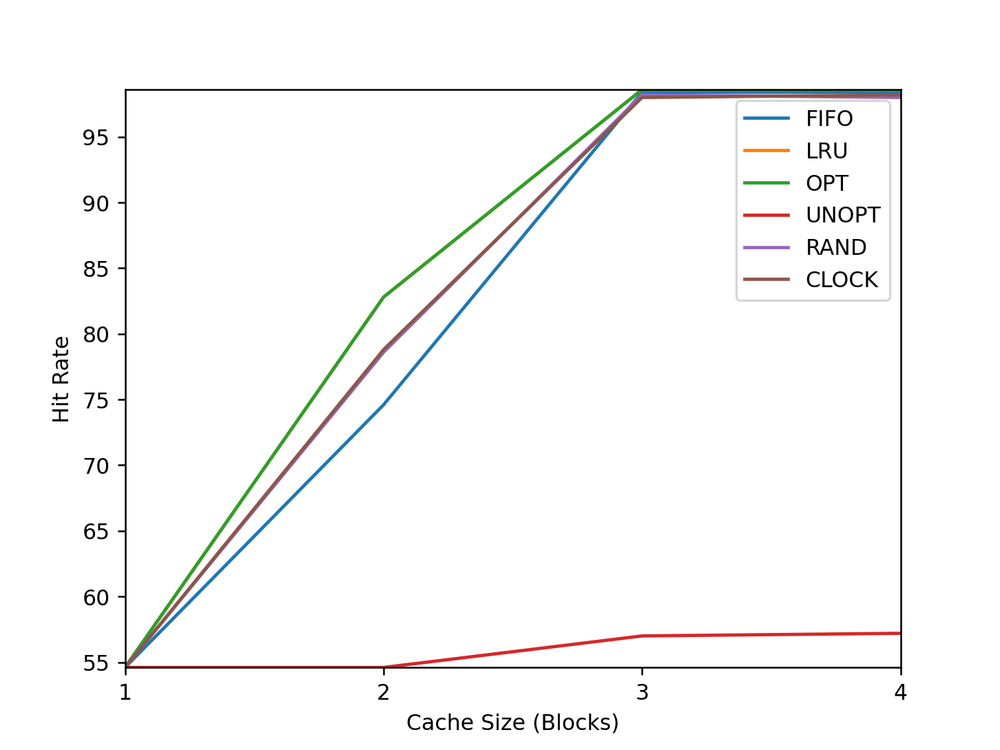

# Chapter 20

## Question 1
Need a single register for top page base register
## Question 2
0x611c -> 0b 11000 01000 11100
0b11000 -> 24, 0b01000 -> 8, 0b11100 -> 28
pages[108][24] -> 0xa1 -> 0b 1 0100001, valid.
0b0100001 -> 33
pages[33][8] -> 0xb5 -> 0b1 0110101, valid.
0b0110101 -> 53
pages[53][28] -> 0x8 -> 8

Three memory access are needed.
## Question 3

It depends. Top level page directory has temporal locality because it will be accessed everytime. Page table has spatial locality.

# Chapter 21
## Question 1
**user time** column value changes to 50 when running 1 instance of mem. It goes to 100 when running 2 instances.
## Question 2
the amount of free memory sometimes increases quite a lot after the program exits.

## Question 3

./mem 2048
allocating 2147483648 bytes (2048.00 MB)
  number of integers in array: 536870912
loop 0 in 3145.17 ms (bandwidth: 651.16 MB/s)
loop 1 in 34464.27 ms (bandwidth: 59.42 MB/s)

first loop is a faster than the subsuquent loops. 

procs -----------memory---------- ---swap-- -----io---- -system-- ------cpu-----
 r  b   swpd   free   buff  cache   si   so    bi    bo   in   cs us sy id wa st
 3  0 1057024  71728      0  23860 69000 62384 69152 62384 2812 4709  1  5 37 57  0
 0  2 1065216  75524      0  23776 64696 72312 64696 72312 2754 4492  1  6 32 62  0
 0  1 1069568  80564      0  24292 61592 66172 62196 66172 2547 4203  1  4 34 61  0
 0  2 1067520  72200      0  28552 63988 61832 71864 61832 3857 6257  2  5 21 71  0
 0  2 1098240  96628      0  35072 45176 76456 53192 76456 2511 3875  1  6 19 75  0
 0  1 1077504  76208      0  36280 66748 46184 76080 46184 2955 4978  1  4 32 62  0
 0  1 1076224  83012      0  33736 66048 65328 66048 65330 2710 4461  2  4 31 64  0
 2  1 1035776  71720      0  30840 79104 51012 79104 51012 3130 5350  2  4 43 51  0
 0  1 949504  65132      0  25448 87568 39236 87568 39296 3104 5692  1  6 44 47  2
 0  1 937728  60596      0  24960 74880 67612 75708 67612 2886 4978  1  7 39 53  0
 0  1 932352  67936      0  24820 67368 69984 67720 69984 2688 4616  2  6 43 50  0
 0  2 947968  76252      0  24312 60512 71684 60512 71684 2429 4081  0  9 36 55  0
 0  2 972800  65872      0  24360 60704 67840 60704 67840 2415 4058  2  6 32 60  0
 0  1 984832  62580      0  24212 62784 65192 62784 65194 2492 4206  1  7 39 53  0
 0  2 992000  61068      0  24792 65600 70588 66216 70728 2640 4497  1  5 41 53  0
 0  1 1018624  65564      0  24788 56096 69824 56096 69824 2315 3793  1  6 35 58  0
 0  1 1048320  63532      0  24732 58144 71396 58144 71396 2347 3911  1  6 36 58  0

## Question 4
When swap is on use, block I/O increases and cpu usage decreases as the process is bottlenecked by I/O.
## Question 5

## Question 6
memory allocation fails at 4000 in my 2GB RAM+2GB Swap configuration.

## Question 7

Swap will be faster on SSDs than HDD. NVMe SSDs will perform better than SATA SSDs.
 

# Chapter 22
## Question 1

python3 paging-policy.py -s 0 n 10  -c
ARG addresses -1
ARG addressfile 
ARG numaddrs 10
ARG policy FIFO
ARG clockbits 2
ARG cachesize 3
ARG maxpage 10
ARG seed 0
ARG notrace False

Solving...

Access: 8  MISS FirstIn ->          [8] <- Lastin  Replaced:- [Hits:0 Misses:1]
Access: 7  MISS FirstIn ->       [8, 7] <- Lastin  Replaced:- [Hits:0 Misses:2]
Access: 4  MISS FirstIn ->    [8, 7, 4] <- Lastin  Replaced:- [Hits:0 Misses:3]
Access: 2  MISS FirstIn ->    [7, 4, 2] <- Lastin  Replaced:8 [Hits:0 Misses:4]
Access: 5  MISS FirstIn ->    [4, 2, 5] <- Lastin  Replaced:7 [Hits:0 Misses:5]
Access: 4  HIT  FirstIn ->    [4, 2, 5] <- Lastin  Replaced:- [Hits:1 Misses:5]
Access: 7  MISS FirstIn ->    [2, 5, 7] <- Lastin  Replaced:4 [Hits:1 Misses:6]
Access: 3  MISS FirstIn ->    [5, 7, 3] <- Lastin  Replaced:2 [Hits:1 Misses:7]
Access: 4  MISS FirstIn ->    [7, 3, 4] <- Lastin  Replaced:5 [Hits:1 Misses:8]
Access: 5  MISS FirstIn ->    [3, 4, 5] <- Lastin  Replaced:7 [Hits:1 Misses:9]

FINALSTATS hits 1   misses 9   hitrate 10.00

python3 paging-policy.py -s 1 n 10  -c -p FIFO
ARG addresses -1
ARG addressfile 
ARG numaddrs 10
ARG policy FIFO
ARG clockbits 2
ARG cachesize 3
ARG maxpage 10
ARG seed 1
ARG notrace False

Solving...

Access: 1  MISS FirstIn ->          [1] <- Lastin  Replaced:- [Hits:0 Misses:1]
Access: 8  MISS FirstIn ->       [1, 8] <- Lastin  Replaced:- [Hits:0 Misses:2]
Access: 7  MISS FirstIn ->    [1, 8, 7] <- Lastin  Replaced:- [Hits:0 Misses:3]
Access: 2  MISS FirstIn ->    [8, 7, 2] <- Lastin  Replaced:1 [Hits:0 Misses:4]
Access: 4  MISS FirstIn ->    [7, 2, 4] <- Lastin  Replaced:8 [Hits:0 Misses:5]
Access: 4  HIT  FirstIn ->    [7, 2, 4] <- Lastin  Replaced:- [Hits:1 Misses:5]
Access: 6  MISS FirstIn ->    [2, 4, 6] <- Lastin  Replaced:7 [Hits:1 Misses:6]
Access: 7  MISS FirstIn ->    [4, 6, 7] <- Lastin  Replaced:2 [Hits:1 Misses:7]
Access: 0  MISS FirstIn ->    [6, 7, 0] <- Lastin  Replaced:4 [Hits:1 Misses:8]
Access: 0  HIT  FirstIn ->    [6, 7, 0] <- Lastin  Replaced:- [Hits:2 Misses:8]

FINALSTATS hits 2   misses 8   hitrate 20.00

➜  CS5600-swap git:(main) python3 paging-policy.py -s 2 n 10  -c -p FIFO
ARG addresses -1
ARG addressfile 
ARG numaddrs 10
ARG policy FIFO
ARG clockbits 2
ARG cachesize 3
ARG maxpage 10
ARG seed 2
ARG notrace False

Solving...

Access: 9  MISS FirstIn ->          [9] <- Lastin  Replaced:- [Hits:0 Misses:1]
Access: 9  HIT  FirstIn ->          [9] <- Lastin  Replaced:- [Hits:1 Misses:1]
Access: 0  MISS FirstIn ->       [9, 0] <- Lastin  Replaced:- [Hits:1 Misses:2]
Access: 0  HIT  FirstIn ->       [9, 0] <- Lastin  Replaced:- [Hits:2 Misses:2]
Access: 8  MISS FirstIn ->    [9, 0, 8] <- Lastin  Replaced:- [Hits:2 Misses:3]
Access: 7  MISS FirstIn ->    [0, 8, 7] <- Lastin  Replaced:9 [Hits:2 Misses:4]
Access: 6  MISS FirstIn ->    [8, 7, 6] <- Lastin  Replaced:0 [Hits:2 Misses:5]
Access: 3  MISS FirstIn ->    [7, 6, 3] <- Lastin  Replaced:8 [Hits:2 Misses:6]
Access: 6  HIT  FirstIn ->    [7, 6, 3] <- Lastin  Replaced:- [Hits:3 Misses:6]
Access: 6  HIT  FirstIn ->    [7, 6, 3] <- Lastin  Replaced:- [Hits:4 Misses:6]

FINALSTATS hits 4   misses 6   hitrate 40.00

➜  CS5600-swap git:(main) python3 paging-policy.py -s 0 n 10  -c -p LRU 
ARG addresses -1
ARG addressfile 
ARG numaddrs 10
ARG policy LRU
ARG clockbits 2
ARG cachesize 3
ARG maxpage 10
ARG seed 0
ARG notrace False

Solving...

Access: 8  MISS LRU ->          [8] <- MRU Replaced:- [Hits:0 Misses:1]
Access: 7  MISS LRU ->       [8, 7] <- MRU Replaced:- [Hits:0 Misses:2]
Access: 4  MISS LRU ->    [8, 7, 4] <- MRU Replaced:- [Hits:0 Misses:3]
Access: 2  MISS LRU ->    [7, 4, 2] <- MRU Replaced:8 [Hits:0 Misses:4]
Access: 5  MISS LRU ->    [4, 2, 5] <- MRU Replaced:7 [Hits:0 Misses:5]
Access: 4  HIT  LRU ->    [2, 5, 4] <- MRU Replaced:- [Hits:1 Misses:5]
Access: 7  MISS LRU ->    [5, 4, 7] <- MRU Replaced:2 [Hits:1 Misses:6]
Access: 3  MISS LRU ->    [4, 7, 3] <- MRU Replaced:5 [Hits:1 Misses:7]
Access: 4  HIT  LRU ->    [7, 3, 4] <- MRU Replaced:- [Hits:2 Misses:7]
Access: 5  MISS LRU ->    [3, 4, 5] <- MRU Replaced:7 [Hits:2 Misses:8]

FINALSTATS hits 2   misses 8   hitrate 20.00

➜  CS5600-swap git:(main) python3 paging-policy.py -s 0 n 10  -c -p LRU
ARG addresses -1
ARG addressfile 
ARG numaddrs 10
ARG policy LRU
ARG clockbits 2
ARG cachesize 3
ARG maxpage 10
ARG seed 0
ARG notrace False

Solving...

Access: 8  MISS LRU ->          [8] <- MRU Replaced:- [Hits:0 Misses:1]
Access: 7  MISS LRU ->       [8, 7] <- MRU Replaced:- [Hits:0 Misses:2]
Access: 4  MISS LRU ->    [8, 7, 4] <- MRU Replaced:- [Hits:0 Misses:3]
Access: 2  MISS LRU ->    [7, 4, 2] <- MRU Replaced:8 [Hits:0 Misses:4]
Access: 5  MISS LRU ->    [4, 2, 5] <- MRU Replaced:7 [Hits:0 Misses:5]
Access: 4  HIT  LRU ->    [2, 5, 4] <- MRU Replaced:- [Hits:1 Misses:5]
Access: 7  MISS LRU ->    [5, 4, 7] <- MRU Replaced:2 [Hits:1 Misses:6]
Access: 3  MISS LRU ->    [4, 7, 3] <- MRU Replaced:5 [Hits:1 Misses:7]
Access: 4  HIT  LRU ->    [7, 3, 4] <- MRU Replaced:- [Hits:2 Misses:7]
Access: 5  MISS LRU ->    [3, 4, 5] <- MRU Replaced:7 [Hits:2 Misses:8]

FINALSTATS hits 2   misses 8   hitrate 20.00

➜  CS5600-swap git:(main) python3 paging-policy.py -s 1 n 10  -c -p LRU
ARG addresses -1
ARG addressfile 
ARG numaddrs 10
ARG policy LRU
ARG clockbits 2
ARG cachesize 3
ARG maxpage 10
ARG seed 1
ARG notrace False

Solving...

Access: 1  MISS LRU ->          [1] <- MRU Replaced:- [Hits:0 Misses:1]
Access: 8  MISS LRU ->       [1, 8] <- MRU Replaced:- [Hits:0 Misses:2]
Access: 7  MISS LRU ->    [1, 8, 7] <- MRU Replaced:- [Hits:0 Misses:3]
Access: 2  MISS LRU ->    [8, 7, 2] <- MRU Replaced:1 [Hits:0 Misses:4]
Access: 4  MISS LRU ->    [7, 2, 4] <- MRU Replaced:8 [Hits:0 Misses:5]
Access: 4  HIT  LRU ->    [7, 2, 4] <- MRU Replaced:- [Hits:1 Misses:5]
Access: 6  MISS LRU ->    [2, 4, 6] <- MRU Replaced:7 [Hits:1 Misses:6]
Access: 7  MISS LRU ->    [4, 6, 7] <- MRU Replaced:2 [Hits:1 Misses:7]
Access: 0  MISS LRU ->    [6, 7, 0] <- MRU Replaced:4 [Hits:1 Misses:8]
Access: 0  HIT  LRU ->    [6, 7, 0] <- MRU Replaced:- [Hits:2 Misses:8]

FINALSTATS hits 2   misses 8   hitrate 20.00

## Question 2

FIFO=0,1,2,3,4,5,0,1,2,3,4,5
LRU= 0,1,2,3,4,5,0,1,2,3,4,5
MRU= 0,1,2,3,4,5,4,5,4,5,4 

## Question 3
➜  CS5600-swap git:(main) ✗ python3 paging-policy.py -s 10 n 13  -p FIFO            
ARG addresses -1
ARG addressfile 
ARG numaddrs 10
ARG policy FIFO
ARG clockbits 2
ARG cachesize 3
ARG maxpage 10
ARG seed 10
ARG notrace False

Assuming a replacement policy of FIFO, and a cache of size 3 pages,
figure out whether each of the following page references hit or miss
in the page cache.

Access: 5  Hit/Miss?  State of Memory?
Access: 4  Hit/Miss?  State of Memory?
Access: 5  Hit/Miss?  State of Memory?
Access: 2  Hit/Miss?  State of Memory?
Access: 8  Hit/Miss?  State of Memory?
Access: 8  Hit/Miss?  State of Memory?
Access: 6  Hit/Miss?  State of Memory?
Access: 1  Hit/Miss?  State of Memory?
Access: 5  Hit/Miss?  State of Memory?
Access: 3  Hit/Miss?  State of Memory?

➜  CS5600-swap git:(main) ✗ python3 paging-policy.py -s 10 n 13  -p FIFO -c
ARG addresses -1
ARG addressfile 
ARG numaddrs 10
ARG policy FIFO
ARG clockbits 2
ARG cachesize 3
ARG maxpage 10
ARG seed 10
ARG notrace False

Solving...

Access: 5  MISS FirstIn ->          [5] <- Lastin  Replaced:- [Hits:0 Misses:1]
Access: 4  MISS FirstIn ->       [5, 4] <- Lastin  Replaced:- [Hits:0 Misses:2]
Access: 5  HIT  FirstIn ->       [5, 4] <- Lastin  Replaced:- [Hits:1 Misses:2]
Access: 2  MISS FirstIn ->    [5, 4, 2] <- Lastin  Replaced:- [Hits:1 Misses:3]
Access: 8  MISS FirstIn ->    [4, 2, 8] <- Lastin  Replaced:5 [Hits:1 Misses:4]
Access: 8  HIT  FirstIn ->    [4, 2, 8] <- Lastin  Replaced:- [Hits:2 Misses:4]
Access: 6  MISS FirstIn ->    [2, 8, 6] <- Lastin  Replaced:4 [Hits:2 Misses:5]
Access: 1  MISS FirstIn ->    [8, 6, 1] <- Lastin  Replaced:2 [Hits:2 Misses:6]
Access: 5  MISS FirstIn ->    [6, 1, 5] <- Lastin  Replaced:8 [Hits:2 Misses:7]
Access: 3  MISS FirstIn ->    [1, 5, 3] <- Lastin  Replaced:6 [Hits:2 Misses:8]

FINALSTATS hits 2   misses 8   hitrate 20.00

➜  CS5600-swap git:(main) ✗ python3 paging-policy.py -s 10 n 13  -p LRU -c 
ARG addresses -1
ARG addressfile 
ARG numaddrs 10
ARG policy LRU
ARG clockbits 2
ARG cachesize 3
ARG maxpage 10
ARG seed 10
ARG notrace False

Solving...

Access: 5  MISS LRU ->          [5] <- MRU Replaced:- [Hits:0 Misses:1]
Access: 4  MISS LRU ->       [5, 4] <- MRU Replaced:- [Hits:0 Misses:2]
Access: 5  HIT  LRU ->       [4, 5] <- MRU Replaced:- [Hits:1 Misses:2]
Access: 2  MISS LRU ->    [4, 5, 2] <- MRU Replaced:- [Hits:1 Misses:3]
Access: 8  MISS LRU ->    [5, 2, 8] <- MRU Replaced:4 [Hits:1 Misses:4]
Access: 8  HIT  LRU ->    [5, 2, 8] <- MRU Replaced:- [Hits:2 Misses:4]
Access: 6  MISS LRU ->    [2, 8, 6] <- MRU Replaced:5 [Hits:2 Misses:5]
Access: 1  MISS LRU ->    [8, 6, 1] <- MRU Replaced:2 [Hits:2 Misses:6]
Access: 5  MISS LRU ->    [6, 1, 5] <- MRU Replaced:8 [Hits:2 Misses:7]
Access: 3  MISS LRU ->    [1, 5, 3] <- MRU Replaced:6 [Hits:2 Misses:8]

FINALSTATS hits 2   misses 8   hitrate 20.00

➜  CS5600-swap git:(main) ✗ python3 paging-policy.py -s 10 n 13  -p MRU -c
ARG addresses -1
ARG addressfile 
ARG numaddrs 10
ARG policy MRU
ARG clockbits 2
ARG cachesize 3
ARG maxpage 10
ARG seed 10
ARG notrace False

Solving...

Access: 5  MISS LRU ->          [5] <- MRU Replaced:- [Hits:0 Misses:1]
Access: 4  MISS LRU ->       [5, 4] <- MRU Replaced:- [Hits:0 Misses:2]
Access: 5  HIT  LRU ->       [4, 5] <- MRU Replaced:- [Hits:1 Misses:2]
Access: 2  MISS LRU ->    [4, 5, 2] <- MRU Replaced:- [Hits:1 Misses:3]
Access: 8  MISS LRU ->    [4, 5, 8] <- MRU Replaced:2 [Hits:1 Misses:4]
Access: 8  HIT  LRU ->    [4, 5, 8] <- MRU Replaced:- [Hits:2 Misses:4]
Access: 6  MISS LRU ->    [4, 5, 6] <- MRU Replaced:8 [Hits:2 Misses:5]
Access: 1  MISS LRU ->    [4, 5, 1] <- MRU Replaced:6 [Hits:2 Misses:6]
Access: 5  HIT  LRU ->    [4, 1, 5] <- MRU Replaced:- [Hits:3 Misses:6]
Access: 3  MISS LRU ->    [4, 1, 3] <- MRU Replaced:5 [Hits:3 Misses:7]

FINALSTATS hits 3   misses 7   hitrate 30.00

➜  CS5600-swap git:(main) ✗ python3 paging-policy.py -s 10 n 13  -p RAND -c
ARG addresses -1
ARG addressfile 
ARG numaddrs 10
ARG policy RAND
ARG clockbits 2
ARG cachesize 3
ARG maxpage 10
ARG seed 10
ARG notrace False

Solving...

Access: 5  MISS Left  ->          [5] <- Right Replaced:- [Hits:0 Misses:1]
Access: 4  MISS Left  ->       [5, 4] <- Right Replaced:- [Hits:0 Misses:2]
Access: 5  HIT  Left  ->       [5, 4] <- Right Replaced:- [Hits:1 Misses:2]
Access: 2  MISS Left  ->    [5, 4, 2] <- Right Replaced:- [Hits:1 Misses:3]
Access: 8  MISS Left  ->    [4, 2, 8] <- Right Replaced:5 [Hits:1 Misses:4]
Access: 8  HIT  Left  ->    [4, 2, 8] <- Right Replaced:- [Hits:2 Misses:4]
Access: 6  MISS Left  ->    [4, 2, 6] <- Right Replaced:8 [Hits:2 Misses:5]
Access: 1  MISS Left  ->    [4, 2, 1] <- Right Replaced:6 [Hits:2 Misses:6]
Access: 5  MISS Left  ->    [2, 1, 5] <- Right Replaced:4 [Hits:2 Misses:7]
Access: 3  MISS Left  ->    [2, 1, 3] <- Right Replaced:5 [Hits:2 Misses:8]

FINALSTATS hits 2   misses 8   hitrate 20.00

## Question 4
➜  CS5600-swap git:(main) ✗ python3 paging-policy.py --addresses=3,0,6,6,6,6,7,0,6,6 -c -p LRU -c 
ARG addresses 3,0,6,6,6,6,7,0,6,6
ARG addressfile 
ARG numaddrs 10
ARG policy LRU
ARG clockbits 2
ARG cachesize 3
ARG maxpage 10
ARG seed 0
ARG notrace False

Solving...

Access: 3  MISS LRU ->          [3] <- MRU Replaced:- [Hits:0 Misses:1]
Access: 0  MISS LRU ->       [3, 0] <- MRU Replaced:- [Hits:0 Misses:2]
Access: 6  MISS LRU ->    [3, 0, 6] <- MRU Replaced:- [Hits:0 Misses:3]
Access: 6  HIT  LRU ->    [3, 0, 6] <- MRU Replaced:- [Hits:1 Misses:3]
Access: 6  HIT  LRU ->    [3, 0, 6] <- MRU Replaced:- [Hits:2 Misses:3]
Access: 6  HIT  LRU ->    [3, 0, 6] <- MRU Replaced:- [Hits:3 Misses:3]
Access: 7  MISS LRU ->    [0, 6, 7] <- MRU Replaced:3 [Hits:3 Misses:4]
Access: 0  HIT  LRU ->    [6, 7, 0] <- MRU Replaced:- [Hits:4 Misses:4]
Access: 6  HIT  LRU ->    [7, 0, 6] <- MRU Replaced:- [Hits:5 Misses:4]
Access: 6  HIT  LRU ->    [7, 0, 6] <- MRU Replaced:- [Hits:6 Misses:4]

FINALSTATS hits 6   misses 4   hitrate 60.00

➜  CS5600-swap git:(main) ✗ python3 paging-policy.py --addresses=3,0,6,6,6,6,7,0,6,6 -c -p RAND  
ARG addresses 3,0,6,6,6,6,7,0,6,6
ARG addressfile 
ARG numaddrs 10
ARG policy RAND
ARG clockbits 2
ARG cachesize 3
ARG maxpage 10
ARG seed 0
ARG notrace False

Solving...

Access: 3  MISS Left  ->          [3] <- Right Replaced:- [Hits:0 Misses:1]
Access: 0  MISS Left  ->       [3, 0] <- Right Replaced:- [Hits:0 Misses:2]
Access: 6  MISS Left  ->    [3, 0, 6] <- Right Replaced:- [Hits:0 Misses:3]
Access: 6  HIT  Left  ->    [3, 0, 6] <- Right Replaced:- [Hits:1 Misses:3]
Access: 6  HIT  Left  ->    [3, 0, 6] <- Right Replaced:- [Hits:2 Misses:3]
Access: 6  HIT  Left  ->    [3, 0, 6] <- Right Replaced:- [Hits:3 Misses:3]
Access: 7  MISS Left  ->    [3, 0, 7] <- Right Replaced:6 [Hits:3 Misses:4]
Access: 0  HIT  Left  ->    [3, 0, 7] <- Right Replaced:- [Hits:4 Misses:4]
Access: 6  MISS Left  ->    [3, 0, 6] <- Right Replaced:7 [Hits:4 Misses:5]
Access: 6  HIT  Left  ->    [3, 0, 6] <- Right Replaced:- [Hits:5 Misses:5]

FINALSTATS hits 5   misses 5   hitrate 50.00

Clock

➜  CS5600-swap git:(main) ✗ python3 paging-policy.py --addresses=3,0,6,6,6,6,7,0,6,6 -c -p CLOCK     
ARG addresses 3,0,6,6,6,6,7,0,6,6
ARG addressfile 
ARG numaddrs 10
ARG policy CLOCK
ARG clockbits 2
ARG cachesize 3
ARG maxpage 10
ARG seed 0
ARG notrace False

Solving...

Access: 3  MISS Left  ->          [3] <- Right Replaced:- [Hits:0 Misses:1]
Access: 0  MISS Left  ->       [3, 0] <- Right Replaced:- [Hits:0 Misses:2]
Access: 6  MISS Left  ->    [3, 0, 6] <- Right Replaced:- [Hits:0 Misses:3]
Access: 6  HIT  Left  ->    [3, 0, 6] <- Right Replaced:- [Hits:1 Misses:3]
Access: 6  HIT  Left  ->    [3, 0, 6] <- Right Replaced:- [Hits:2 Misses:3]
Access: 6  HIT  Left  ->    [3, 0, 6] <- Right Replaced:- [Hits:3 Misses:3]
Access: 7  MISS Left  ->    [3, 6, 7] <- Right Replaced:0 [Hits:3 Misses:4]
Access: 0  MISS Left  ->    [3, 7, 0] <- Right Replaced:6 [Hits:3 Misses:5]
Access: 6  MISS Left  ->    [7, 0, 6] <- Right Replaced:3 [Hits:3 Misses:6]
Access: 6  HIT  Left  ->    [7, 0, 6] <- Right Replaced:- [Hits:4 Misses:6]

FINALSTATS hits 4   misses 6   hitrate 40.00

➜  CS5600-swap git:(main) ✗ python3 paging-policy.py --addresses=3,0,6,6,6,6,7,0,6,6 -c -p CLOCK -b 1
ARG addresses 3,0,6,6,6,6,7,0,6,6
ARG addressfile 
ARG numaddrs 10
ARG policy CLOCK
ARG clockbits 1
ARG cachesize 3
ARG maxpage 10
ARG seed 0
ARG notrace False

Solving...

Access: 3  MISS Left  ->          [3] <- Right Replaced:- [Hits:0 Misses:1]
Access: 0  MISS Left  ->       [3, 0] <- Right Replaced:- [Hits:0 Misses:2]
Access: 6  MISS Left  ->    [3, 0, 6] <- Right Replaced:- [Hits:0 Misses:3]
Access: 6  HIT  Left  ->    [3, 0, 6] <- Right Replaced:- [Hits:1 Misses:3]
Access: 6  HIT  Left  ->    [3, 0, 6] <- Right Replaced:- [Hits:2 Misses:3]
Access: 6  HIT  Left  ->    [3, 0, 6] <- Right Replaced:- [Hits:3 Misses:3]
Access: 7  MISS Left  ->    [3, 0, 7] <- Right Replaced:6 [Hits:3 Misses:4]
Access: 0  HIT  Left  ->    [3, 0, 7] <- Right Replaced:- [Hits:4 Misses:4]
Access: 6  MISS Left  ->    [3, 7, 6] <- Right Replaced:0 [Hits:4 Misses:5]
Access: 6  HIT  Left  ->    [3, 7, 6] <- Right Replaced:- [Hits:5 Misses:5]

FINALSTATS hits 5   misses 5   hitrate 50.00

➜  CS5600-swap git:(main) ✗ python3 paging-policy.py --addresses=3,0,6,6,6,6,7,0,6,6 -c -p CLOCK -b 2
ARG addresses 3,0,6,6,6,6,7,0,6,6
ARG addressfile 
ARG numaddrs 10
ARG policy CLOCK
ARG clockbits 2
ARG cachesize 3
ARG maxpage 10
ARG seed 0
ARG notrace False

Solving...

Access: 3  MISS Left  ->          [3] <- Right Replaced:- [Hits:0 Misses:1]
Access: 0  MISS Left  ->       [3, 0] <- Right Replaced:- [Hits:0 Misses:2]
Access: 6  MISS Left  ->    [3, 0, 6] <- Right Replaced:- [Hits:0 Misses:3]
Access: 6  HIT  Left  ->    [3, 0, 6] <- Right Replaced:- [Hits:1 Misses:3]
Access: 6  HIT  Left  ->    [3, 0, 6] <- Right Replaced:- [Hits:2 Misses:3]
Access: 6  HIT  Left  ->    [3, 0, 6] <- Right Replaced:- [Hits:3 Misses:3]
Access: 7  MISS Left  ->    [3, 6, 7] <- Right Replaced:0 [Hits:3 Misses:4]
Access: 0  MISS Left  ->    [3, 7, 0] <- Right Replaced:6 [Hits:3 Misses:5]
Access: 6  MISS Left  ->    [7, 0, 6] <- Right Replaced:3 [Hits:3 Misses:6]
Access: 6  HIT  Left  ->    [7, 0, 6] <- Right Replaced:- [Hits:4 Misses:6]

FINALSTATS hits 4   misses 6   hitrate 40.00

➜  CS5600-swap git:(main) ✗ python3 paging-policy.py --addresses=3,0,6,6,6,6,7,0,6,6 -c -p CLOCK -b 3
ARG addresses 3,0,6,6,6,6,7,0,6,6
ARG addressfile 
ARG numaddrs 10
ARG policy CLOCK
ARG clockbits 3
ARG cachesize 3
ARG maxpage 10
ARG seed 0
ARG notrace False

Solving...

Access: 3  MISS Left  ->          [3] <- Right Replaced:- [Hits:0 Misses:1]
Access: 0  MISS Left  ->       [3, 0] <- Right Replaced:- [Hits:0 Misses:2]
Access: 6  MISS Left  ->    [3, 0, 6] <- Right Replaced:- [Hits:0 Misses:3]
Access: 6  HIT  Left  ->    [3, 0, 6] <- Right Replaced:- [Hits:1 Misses:3]
Access: 6  HIT  Left  ->    [3, 0, 6] <- Right Replaced:- [Hits:2 Misses:3]
Access: 6  HIT  Left  ->    [3, 0, 6] <- Right Replaced:- [Hits:3 Misses:3]
Access: 7  MISS Left  ->    [3, 6, 7] <- Right Replaced:0 [Hits:3 Misses:4]
Access: 0  MISS Left  ->    [6, 7, 0] <- Right Replaced:3 [Hits:3 Misses:5]
Access: 6  HIT  Left  ->    [6, 7, 0] <- Right Replaced:- [Hits:4 Misses:5]
Access: 6  HIT  Left  ->    [6, 7, 0] <- Right Replaced:- [Hits:5 Misses:5]

FINALSTATS hits 5   misses 5   hitrate 50.00

➜  CS5600-swap git:(main) ✗ python3 paging-policy.py --addresses=3,0,6,6,6,6,7,0,6,6 -c -p CLOCK -b 4 
ARG addresses 3,0,6,6,6,6,7,0,6,6
ARG addressfile 
ARG numaddrs 10
ARG policy CLOCK
ARG clockbits 4
ARG cachesize 3
ARG maxpage 10
ARG seed 0
ARG notrace False

Solving...

Access: 3  MISS Left  ->          [3] <- Right Replaced:- [Hits:0 Misses:1]
Access: 0  MISS Left  ->       [3, 0] <- Right Replaced:- [Hits:0 Misses:2]
Access: 6  MISS Left  ->    [3, 0, 6] <- Right Replaced:- [Hits:0 Misses:3]
Access: 6  HIT  Left  ->    [3, 0, 6] <- Right Replaced:- [Hits:1 Misses:3]
Access: 6  HIT  Left  ->    [3, 0, 6] <- Right Replaced:- [Hits:2 Misses:3]
Access: 6  HIT  Left  ->    [3, 0, 6] <- Right Replaced:- [Hits:3 Misses:3]
Access: 7  MISS Left  ->    [3, 6, 7] <- Right Replaced:0 [Hits:3 Misses:4]
Access: 0  MISS Left  ->    [6, 7, 0] <- Right Replaced:3 [Hits:3 Misses:5]
Access: 6  HIT  Left  ->    [6, 7, 0] <- Right Replaced:- [Hits:4 Misses:5]
Access: 6  HIT  Left  ->    [6, 7, 0] <- Right Replaced:- [Hits:5 Misses:5]

FINALSTATS hits 5   misses 5   hitrate 50.00

➜  CS5600-swap git:(main) ✗ python3 paging-policy.py --addresses=3,0,6,6,6,6,7,0,6,6 -c -p CLOCK -b 5
ARG addresses 3,0,6,6,6,6,7,0,6,6
ARG addressfile 
ARG numaddrs 10
ARG policy CLOCK
ARG clockbits 5
ARG cachesize 3
ARG maxpage 10
ARG seed 0
ARG notrace False

Solving...

Access: 3  MISS Left  ->          [3] <- Right Replaced:- [Hits:0 Misses:1]
Access: 0  MISS Left  ->       [3, 0] <- Right Replaced:- [Hits:0 Misses:2]
Access: 6  MISS Left  ->    [3, 0, 6] <- Right Replaced:- [Hits:0 Misses:3]
Access: 6  HIT  Left  ->    [3, 0, 6] <- Right Replaced:- [Hits:1 Misses:3]
Access: 6  HIT  Left  ->    [3, 0, 6] <- Right Replaced:- [Hits:2 Misses:3]
Access: 6  HIT  Left  ->    [3, 0, 6] <- Right Replaced:- [Hits:3 Misses:3]
Access: 7  MISS Left  ->    [3, 6, 7] <- Right Replaced:0 [Hits:3 Misses:4]
Access: 0  MISS Left  ->    [6, 7, 0] <- Right Replaced:3 [Hits:3 Misses:5]
Access: 6  HIT  Left  ->    [6, 7, 0] <- Right Replaced:- [Hits:4 Misses:5]
Access: 6  HIT  Left  ->    [6, 7, 0] <- Right Replaced:- [Hits:5 Misses:5]

FINALSTATS hits 5   misses 5   hitrate 50.00

➜  CS5600-swap git:(main) ✗ python3 paging-policy.py --addresses=3,0,6,6,6,6,7,0,6,6 -c -p CLOCK -b 6
ARG addresses 3,0,6,6,6,6,7,0,6,6
ARG addressfile 
ARG numaddrs 10
ARG policy CLOCK
ARG clockbits 6
ARG cachesize 3
ARG maxpage 10
ARG seed 0
ARG notrace False

Solving...

Access: 3  MISS Left  ->          [3] <- Right Replaced:- [Hits:0 Misses:1]
Access: 0  MISS Left  ->       [3, 0] <- Right Replaced:- [Hits:0 Misses:2]
Access: 6  MISS Left  ->    [3, 0, 6] <- Right Replaced:- [Hits:0 Misses:3]
Access: 6  HIT  Left  ->    [3, 0, 6] <- Right Replaced:- [Hits:1 Misses:3]
Access: 6  HIT  Left  ->    [3, 0, 6] <- Right Replaced:- [Hits:2 Misses:3]
Access: 6  HIT  Left  ->    [3, 0, 6] <- Right Replaced:- [Hits:3 Misses:3]
Access: 7  MISS Left  ->    [3, 6, 7] <- Right Replaced:0 [Hits:3 Misses:4]
Access: 0  MISS Left  ->    [6, 7, 0] <- Right Replaced:3 [Hits:3 Misses:5]
Access: 6  HIT  Left  ->    [6, 7, 0] <- Right Replaced:- [Hits:4 Misses:5]
Access: 6  HIT  Left  ->    [6, 7, 0] <- Right Replaced:- [Hits:5 Misses:5]

FINALSTATS hits 5   misses 5   hitrate 50.00

## Question 5

[root@imranvpn 22]# ./run.sh 
ARG addresses -1
ARG addressfile ./vpn_500.txt
ARG numaddrs 10
ARG policy FIFO
ARG clockbits 2
ARG cachesize 1
ARG maxpage 10
ARG seed 0
ARG notrace True

FINALSTATS hits 273   misses 227   hitrate 54.60

ARG addresses -1
ARG addressfile ./vpn_500.txt
ARG numaddrs 10
ARG policy FIFO
ARG clockbits 2
ARG cachesize 2
ARG maxpage 10
ARG seed 0
ARG notrace True

FINALSTATS hits 373   misses 127   hitrate 74.60

ARG addresses -1
ARG addressfile ./vpn_500.txt
ARG numaddrs 10
ARG policy FIFO
ARG clockbits 2
ARG cachesize 3
ARG maxpage 10
ARG seed 0
ARG notrace True

FINALSTATS hits 492   misses 8   hitrate 98.40

ARG addresses -1
ARG addressfile ./vpn_500.txt
ARG numaddrs 10
ARG policy FIFO
ARG clockbits 2
ARG cachesize 4
ARG maxpage 10
ARG seed 0
ARG notrace True

FINALSTATS hits 492   misses 8   hitrate 98.40

ARG addresses -1
ARG addressfile ./vpn_500.txt
ARG numaddrs 10
ARG policy LRU
ARG clockbits 2
ARG cachesize 1
ARG maxpage 10
ARG seed 0
ARG notrace True

FINALSTATS hits 273   misses 227   hitrate 54.60

ARG addresses -1
ARG addressfile ./vpn_500.txt
ARG numaddrs 10
ARG policy LRU
ARG clockbits 2
ARG cachesize 2
ARG maxpage 10
ARG seed 0
ARG notrace True

FINALSTATS hits 414   misses 86   hitrate 82.80

ARG addresses -1
ARG addressfile ./vpn_500.txt
ARG numaddrs 10
ARG policy LRU
ARG clockbits 2
ARG cachesize 3
ARG maxpage 10
ARG seed 0
ARG notrace True

FINALSTATS hits 493   misses 7   hitrate 98.60

ARG addresses -1
ARG addressfile ./vpn_500.txt
ARG numaddrs 10
ARG policy LRU
ARG clockbits 2
ARG cachesize 4
ARG maxpage 10
ARG seed 0
ARG notrace True

FINALSTATS hits 493   misses 7   hitrate 98.60

ARG addresses -1
ARG addressfile ./vpn_500.txt
ARG numaddrs 10
ARG policy OPT
ARG clockbits 2
ARG cachesize 1
ARG maxpage 10
ARG seed 0
ARG notrace True

FINALSTATS hits 273   misses 227   hitrate 54.60

ARG addresses -1
ARG addressfile ./vpn_500.txt
ARG numaddrs 10
ARG policy OPT
ARG clockbits 2
ARG cachesize 2
ARG maxpage 10
ARG seed 0
ARG notrace True

FINALSTATS hits 414   misses 86   hitrate 82.80

ARG addresses -1
ARG addressfile ./vpn_500.txt
ARG numaddrs 10
ARG policy OPT
ARG clockbits 2
ARG cachesize 3
ARG maxpage 10
ARG seed 0
ARG notrace True

FINALSTATS hits 493   misses 7   hitrate 98.60

ARG addresses -1
ARG addressfile ./vpn_500.txt
ARG numaddrs 10
ARG policy OPT
ARG clockbits 2
ARG cachesize 4
ARG maxpage 10
ARG seed 0
ARG notrace True

FINALSTATS hits 493   misses 7   hitrate 98.60

ARG addresses -1
ARG addressfile ./vpn_500.txt
ARG numaddrs 10
ARG policy UNOPT
ARG clockbits 2
ARG cachesize 1
ARG maxpage 10
ARG seed 0
ARG notrace True

FINALSTATS hits 273   misses 227   hitrate 54.60

ARG addresses -1
ARG addressfile ./vpn_500.txt
ARG numaddrs 10
ARG policy UNOPT
ARG clockbits 2
ARG cachesize 2
ARG maxpage 10
ARG seed 0
ARG notrace True

FINALSTATS hits 273   misses 227   hitrate 54.60

ARG addresses -1
ARG addressfile ./vpn_500.txt
ARG numaddrs 10
ARG policy UNOPT
ARG clockbits 2
ARG cachesize 3
ARG maxpage 10
ARG seed 0
ARG notrace True

FINALSTATS hits 285   misses 215   hitrate 57.00

ARG addresses -1
ARG addressfile ./vpn_500.txt
ARG numaddrs 10
ARG policy UNOPT
ARG clockbits 2
ARG cachesize 4
ARG maxpage 10
ARG seed 0
ARG notrace True

FINALSTATS hits 286   misses 214   hitrate 57.20

ARG addresses -1
ARG addressfile ./vpn_500.txt
ARG numaddrs 10
ARG policy RAND
ARG clockbits 2
ARG cachesize 1
ARG maxpage 10
ARG seed 0
ARG notrace True

FINALSTATS hits 273   misses 227   hitrate 54.60

ARG addresses -1
ARG addressfile ./vpn_500.txt
ARG numaddrs 10
ARG policy RAND
ARG clockbits 2
ARG cachesize 2
ARG maxpage 10
ARG seed 0
ARG notrace True

FINALSTATS hits 393   misses 107   hitrate 78.60

ARG addresses -1
ARG addressfile ./vpn_500.txt
ARG numaddrs 10
ARG policy RAND
ARG clockbits 2
ARG cachesize 3
ARG maxpage 10
ARG seed 0
ARG notrace True

FINALSTATS hits 491   misses 9   hitrate 98.20

ARG addresses -1
ARG addressfile ./vpn_500.txt
ARG numaddrs 10
ARG policy RAND
ARG clockbits 2
ARG cachesize 4
ARG maxpage 10
ARG seed 0
ARG notrace True

FINALSTATS hits 490   misses 10   hitrate 98.00

ARG addresses -1
ARG addressfile ./vpn_500.txt
ARG numaddrs 10
ARG policy CLOCK
ARG clockbits 2
ARG cachesize 1
ARG maxpage 10
ARG seed 0
ARG notrace True

FINALSTATS hits 273   misses 227   hitrate 54.60

ARG addresses -1
ARG addressfile ./vpn_500.txt
ARG numaddrs 10
ARG policy CLOCK
ARG clockbits 2
ARG cachesize 2
ARG maxpage 10
ARG seed 0
ARG notrace True

FINALSTATS hits 394   misses 106   hitrate 78.80

ARG addresses -1
ARG addressfile ./vpn_500.txt
ARG numaddrs 10
ARG policy CLOCK
ARG clockbits 2
ARG cachesize 3
ARG maxpage 10
ARG seed 0
ARG notrace True

FINALSTATS hits 490   misses 10   hitrate 98.00

ARG addresses -1
ARG addressfile ./vpn_500.txt
ARG numaddrs 10
ARG policy CLOCK
ARG clockbits 2
ARG cachesize 4
ARG maxpage 10
ARG seed 0
ARG notrace True

FINALSTATS hits 491   misses 9   hitrate 98.20

